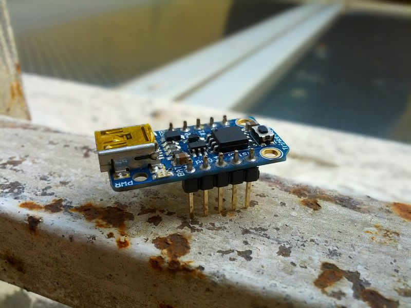
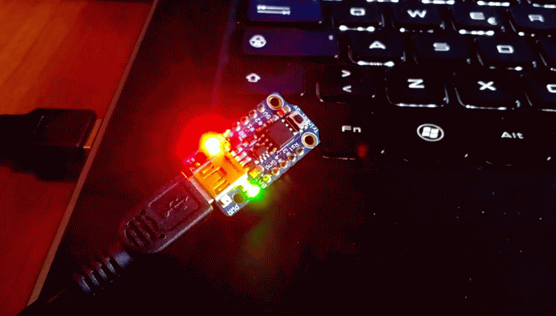

+++
title = 'Personal Notes on getting adafruit Trinket to work on Ubuntu 14.04'
date = 2014-07-31T00:00:00+02:00
+++

I bought a couple of [adafruit Trinket](https://learn.adafruit.com/introducing-trinket/introduction) some time ago, but i got the time to work on them only yesterday.

As described in their [manual](https://learn.adafruit.com/introducing-trinket/introduction), Linux (and arduino 1.5) is not supported, because sometimes the kernel does not create the device node when trinket is inserted in the usbport.

I suspect the problem lies in the fact that trinket uses only attiny85, and implements the usb stack in software. so probably a subtle bug in linux or in the trinket prevents a proper handshake. 

The first time i tried using this board, i was using Ubuntu 13.10, and i believe i had the same problem. Having Upgraded to Ubuntu 14.04, i hoped the situation somewhat improved, as it did.
Now running

	lsusb

return also

	Bus 003 Device 032: ID 1781:0c9f Multiple Vendors USBtiny

which is the right vendorId:productId identifier, and rightly indicates that the device is a USBtiny programmer. 

The guide [here](https://learn.adafruit.com/introducing-trinket/setting-up-with-arduino-ide) gives instruction to substitute the installed avrdude.conf with their avrdude.conf, but mine version seems more recent than theirs, so i opted to integrate the changes using [meld](http://meldmerge.org/), a visual merge tool. in the end, the important differences are some valors inside the ATtiny85 section, so it's easier to copy the adafruit's section inside the local version.

first we have to find where avrdude.conf is installed.
the command

	$ find / -name "avrdude.conf" 2>/dev/null

search for `avrdude.conf` from the root. `2>/dev/null` discard every error message about denied permission to read a subdirectory. 

on my pc, avrdude.conf is installed in two places: `/etc/avrdude.conf` and `/usr/share/arduino/hardware/tools/avrdude.conf`. To be sure, i will patch them both.

the adafruit's file contains a section, started by 

	#------------------------------------------------------------
	# ATtiny85
	#------------------------------------------------------------

that describes the parameters to work with the chip. I just copy the section from this header to the next and substitute it to the equivalent section inside the local copies. For simplicity, this is the part with the correct values to write inside the local copies:

[https://gist.github.com/andijcr/f4a660fde4035fb0a3aa](https://gist.github.com/andijcr/f4a660fde4035fb0a3aa)

remember that you have to be root to modify your local copies.

After patching the avrdude conf the command 

	$ sudo avrdude -c usbtiny -p m8

returns

	avrdude: AVR device initialized and ready to accept instructions

	Reading | ################################################## | 100% 0.00s

	avrdude: Device signature = 0x1e930b
	avrdude: Expected signature for ATmega8 is 1E 93 07
			 Double check chip, or use -F to override this check.

	avrdude done.  Thank you.

this means that the trinket should be ready to be programmed!

let's fire up the blink program, from the examples:


/*
Blink
Turns on an LED on for one second, then off for one second, repeatedly.
This example code is in the public domain.
 
To upload to your Gemma or Trinket:
1) Select the proper board from the Tools->Board Menu
2) Select USBtinyISP from the Tools->Programmer
3) Plug in the Gemma/Trinket, make sure you see the green LED lit
4) For windows, install the USBtiny drivers
5) Press the button on the Gemma/Trinket - verify you see
the red LED pulse. This means it is ready to receive data
6) Click the upload button above within 10 seconds
*/
int led = 1; // blink 'digital' pin 1 - AKA the built in red LED

// the setup routine runs once when you press reset:
void setup() {
// initialize the digital pin as an output.
	pinMode(led, OUTPUT);
}

// the loop routine runs over and over again forever:
void loop() {
	digitalWrite(led, HIGH);
	delay(1000);
	digitalWrite(led, LOW);
	delay(1000);
}


as avrdude still requires root to use the device, i use the arduino ide to verify the code. this action produces an uploadable hex in the temp build folder. grab the binary - named sketch_jul30a.cpp.hex in my case - and the command to write the program is this (remember to enter bootloader mode): 

	$ sudo avrdude  -c usbtiny -p attiny85 -U flash:w:sketch_jul30a.cpp.hex

if successful:

What remains to be done?

working as root to upload a sketch is cumbersome. by adding the correct rules (following [this](http://mightyohm.com/blog/2010/03/run-avrdude-without-root-privs-in-ubuntu/) with some corrections from [this](http://forums.linuxmint.com/viewtopic.php?f=58&t=116115)) is it possible to use avrdude as user, and upload the sketch directly from the arduino ide.

the first step is to add a new rule to /etc/udev/rules.d, and then reload the udev daemon.


#as root:

$ echo 'SUBSYSTEM=="usb", ATTR{idVendor}=="1781", ATTR{idProduct}=="0c9f", MODE="0666", GROUP="plugdev"' > /etc/udev/rules.d/99-trinket.rules
$ restart udev



note that the `GROUP` attribute is set to `plugdev`
this value is the name of a group which my user is part of. to know which groups your user belongs, you can run the command

	groups [your user]

and choose an appropriate value.

after doing this, running

	$ avrdude -c usbtiny -p m8

in bootloader mode should give the same result as the `sudo` version. 

finally, we can use the arduino ide to upload the blink sketch.