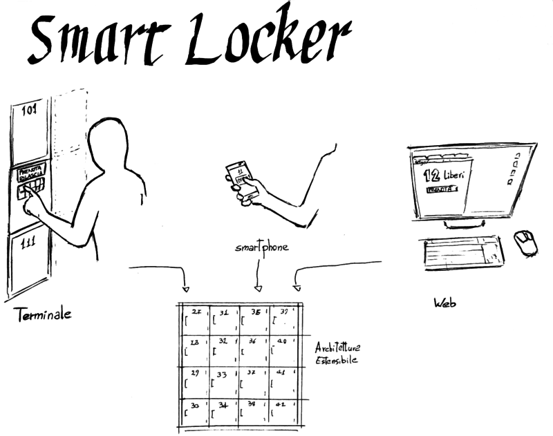

+++
title= 'First version of the graphic for the presentation of Smart Locker'
date= 2014-07-27T00:00:00+02:00
+++

for the project Smart Locker, in realization inside [MUG](https://www.facebook.com/mugroma3), i designed this graphic (sorry for the filesize and quality):

I designed a first draft with pencil and pen

After a quick clean-up with Gimp

I used Inkscape to vectorize the drawing

For the final image (the first of this post) I tried to recreate a Blueprint effect, setting as background the color #3366FF, and a relatively thick line(4 px, even though the "px" unit only makes sense in relation to the size of the final image)

I think there will be a 2.0 version, because the font and lettering are not really suitable, and the composition is unclear. I will probably modify the design of the lockers too.

Tool of great use of Inkscape: Extensions> Modify Path> Perspective. is invaluable for rapid fake prospectives.
